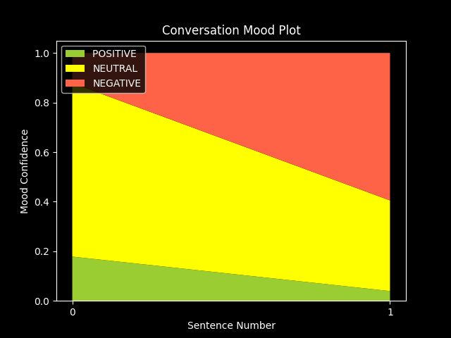
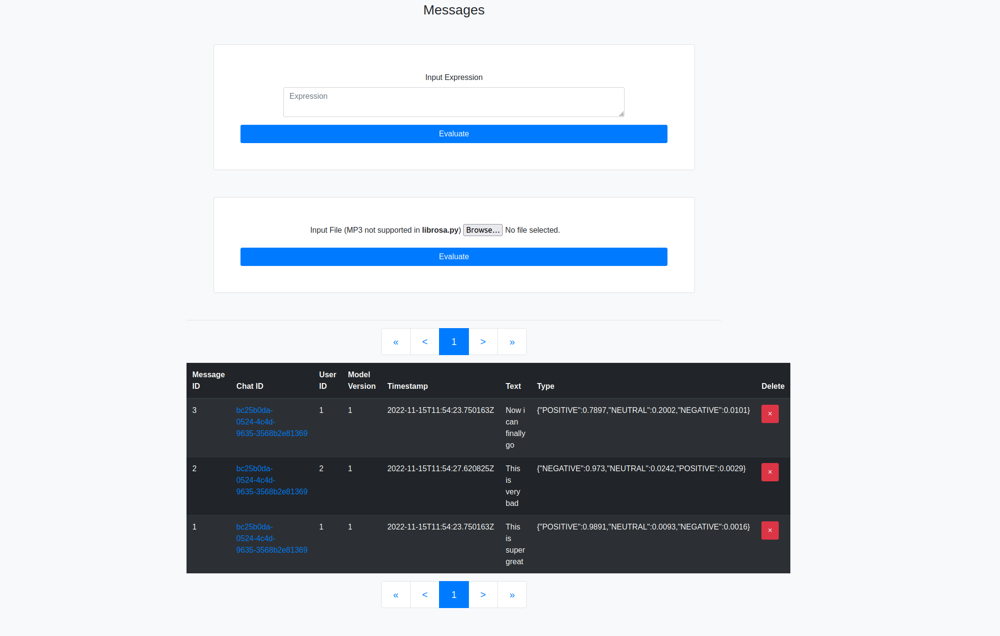
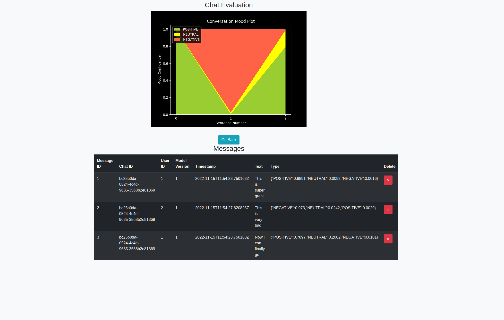

# AGMDOZ
Проект по АНАЛИЗ НА ГОЛЕМИ ДАННИ И ИНТЕРНЕТ НА НЕЩАТА

## Цел на проекта

Идеята зад проекта е оценка на цялостни разговори чрез модела twitter-roberta-base-sentiment.
Представени са възможности за оценявате по 2 основни метода чрез дадените алгоритми.

### Метод 1 - Снабдяване на аудио файл на разговор 
Системата получава аудио файла и го обработва асинхронно. 
Първначално, аудио информацията преминава през Python скрипт, 
който трансформира аудиото в текст. Скриптът използва модела **wav2vec2-large-a**, от който получаваме цялостния текст от файла. 
Поради нуждата от правилна класификация на настроенията на всяко изречение от разговора е важно да добавим необходимата пунктуация.
Това се случва чрез прекарване на получения текст през скрипт за пунктуация. Моделът се съдържа в модула **deepmultilingualpunctuation** за Python. 
След получения пунктуационно правилен текст можем да започнем с оценката на отделните изречения. Подаваме всяко от тях на скрипта ни за оценка и получаваме 
3 процентни стойности за увереността на модела за настроението:
 * Позитивно
 * Неутрално
 * Негативно

След оцеката на всяко изречение подаваме ресултатите към визуализиращ срипт, който ни дава повече визуална информация под формата на графика от следния тип (тук е показан разговор от 2 изречения и техните настроения):

### Метод 2 - Подаване на отделни съобщения чрез публични API ендпойнти
При този метод нямаме нужда от аудио обработка, което увеличава скоростта на извършените операции.
Чрез конкретно подаден параметър chatId можем да групираме отделни съобщение, които се запазват в база данни. 
При избиране на един от въпросните разговори от админския панел, получаваме списък с всички съобщения в него, както и графика за настроенията на разговора.
Операциите се извършват по подобен на Метод 1 начин. 

### Допълнителни бележки
* Визуализация на админския панел

* Визуализация на конкретен разговор, проведен през потребителското API

* Дадена е и възможност за оценка на конкретен израз чрез админския панел
* Комуникацията на сървъра с отделните скриптовe е изпълнена чрез подаване на конкретните аргументи при пускането на самия скрипт,
след което резултатът от него е прихванат съответно от системните **stdout** и **stderr**:
  * **transcribe.py** _\<relative audio file path>_
  * **punctuate.py** _\<raw transcribed text in a single line>_
  * **evaluate.py** _\<single sentence of text>_
  * **visualize.py** _\<request ID> <[array of triples of values in the form (pos_val, neut_val, neg_val), recurring for each sentence]>_

* Python dependencies:
  * sentencepiece
  * deepmultilingualpunctuation
  * transformers
  * scipy
  * numpy
  * matplotlib
  * torch
